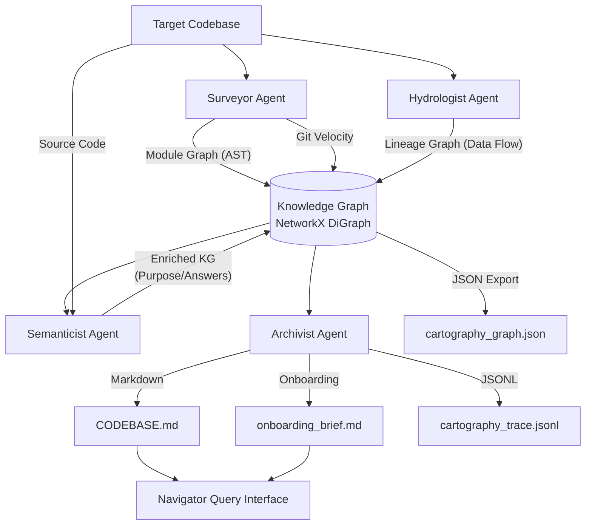
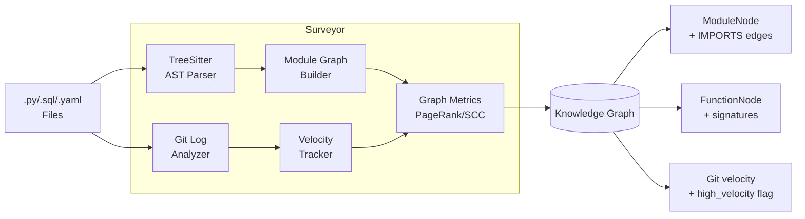
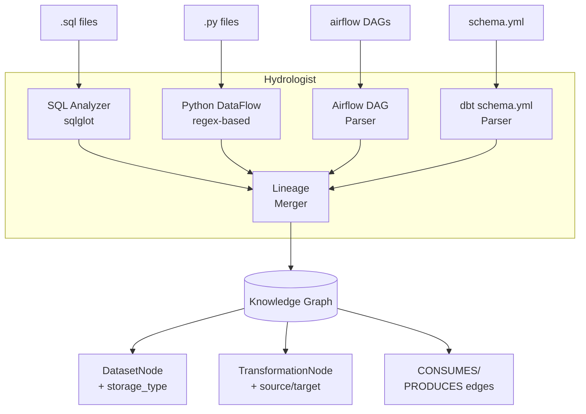
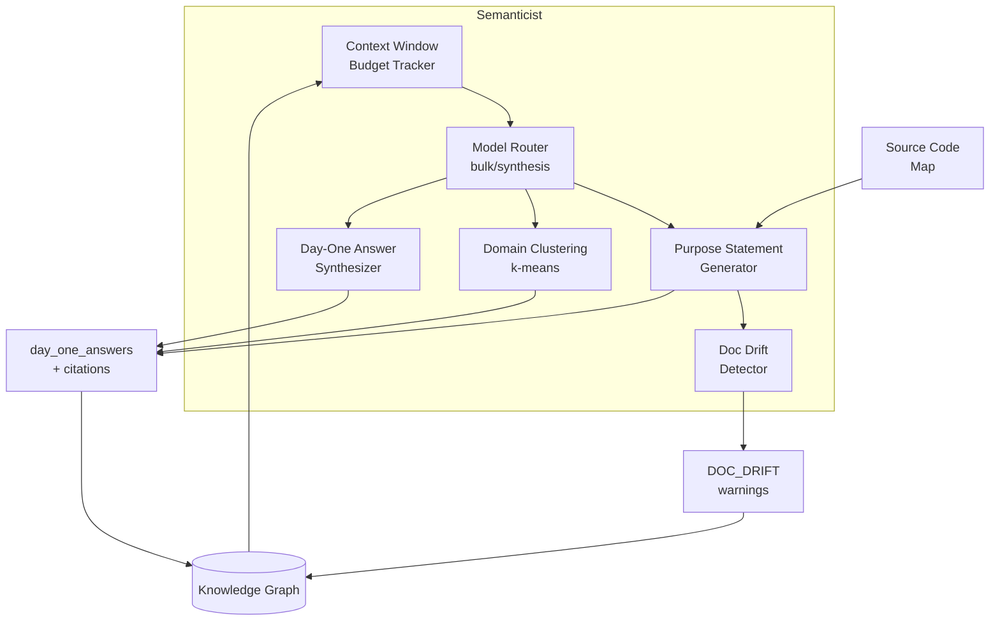
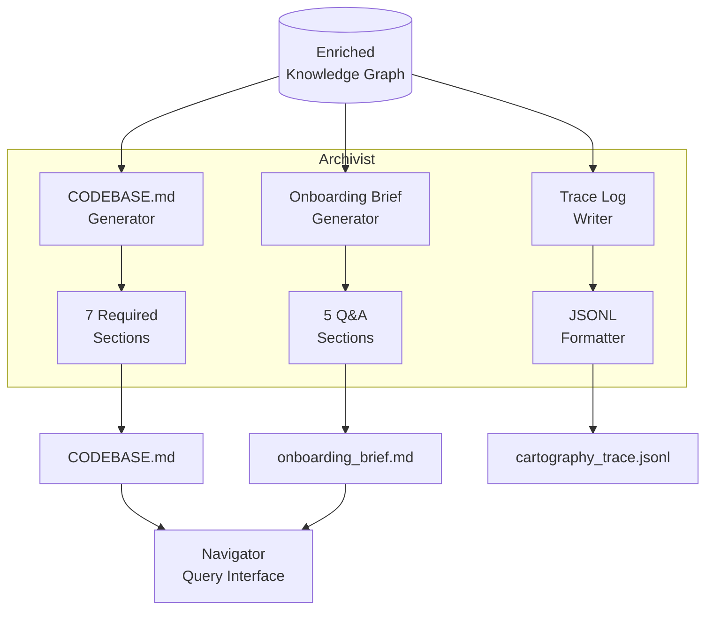

# Brownfield Cartographer: Architecture & Performance Report

**Author:** Mamaru Yirga 
**Date:** March 14, 2026

---

## Project Overview

The **Brownfield Cartographer** is a multi-agent pipeline designed to automate the first-day reconnaissance that Forward Deployed Engineers perform when dropped into an unfamiliar codebase. Given a target repository, it produces structured, living documentation — answering the five core questions an FDE needs answered before they can be productive.

The system is composed of four specialized agents: the **Surveyor** maps module structure and git velocity via static AST analysis; the **Hydrologist** traces data lineage across SQL, Python, Airflow, and dbt; the **Semanticist** enriches the graph with LLM-generated purpose statements and synthesizes Day-One answers; and the **Archivist** renders the enriched graph into `CODEBASE.md`, `onboarding_brief.md`, and a JSONL audit trace. A **Navigator** query interface allows FDEs to interrogate the graph interactively after the initial analysis.

---

## 1. Manual Reconnaissance Depth (Ground Truth)
*Target Codebase: `Document-Intelligence-Refinery` (DIR)*

### Day-One Questions (Manual Answers)

| Question | Manual Answer & Evidence |
| :--- | :--- |
| **1. Primary data ingestion path** | PDFs are ingested from the `data/` directory. The entry point is `src/main.py`, which uses `TriageAgent` to classify documents and `ExtractionRouter` to select an extraction strategy.   **Evidence:** `src/main.py:35,79-80`. |
| **2. 3-5 most critical output datasets/endpoints** | 1. Extracted JSON artifacts in `.refinery/extracted/`.   2. Document profiles in `.refinery/profiles/`.   3. Refined semantic chunks in `.refinery/refined/`.   4. Audit verification results via `AuditManager`.   **Evidence:** `src/main.py:59-82`, `src/agents/audit.py`. |
| **3. Blast radius of the most critical module** | `src/agents/extractor.py` (`ExtractionRouter`). If this router or its capability discovery fails, the system cannot process any documents, rendering downstream agents (Semanticist, Archivist) useless.   **Evidence:** `src/main.py:80`. |
| **4. where business logic is concentrated vs. distributed** | concentrated in `src/strategies/` (extraction logic) and `src/agents/` (refinement and audit orchestration).   **Evidence:** `src/main.py` imports. |
| **5. what has changed most frequently in the last 90 days** | 1. `src/models/core.py` (6 changes)   2. `src/strategies/layout.py` (5)   3. `src/agents/query_agent.py` (5)   4. `src/main.py` (4)   5. `src/strategies/vision.py` (4) |

### Difficulty Analysis
The hardest part of manual analysis was tracing the **dynamic strategy discovery**. `ExtractionRouter` uses a discovery mechanism to find suitable strategies for a document. Manually verifying which strategy would be picked for a specific PDF requires simulating the triage logic and checking strategy decorators—a labor-intensive process that "lineage graph" automation aims to solve. This structural property (decorator-based registration) is a prime target for the automated `Hydrologist` agent.

---

## 2. Architecture Diagram and Pipeline Design Rationale

### System Architecture
The Cartographer follows a four-agent sequential pipeline centered around a shared **Knowledge Graph (NetworkX DiGraph)**.

### Agent-Specific Architectures

#### Surveyor: Structural Analysis

**Surveyor produces:** ModuleNode entities with `path`, `language`, `change_velocity_30d`, `complexity_score`, `pagerank`, `scc_id` (circular dependency detection), and `is_dead_code_candidate` flags. Import resolution converts relative imports to absolute module paths using a module index. PageRank identifies structural centrality; Strongly Connected Components detect circular dependencies.

#### Hydrologist: Data Lineage Extraction

**Hydrologist produces:** DatasetNode entities (`dataset:<name>`), TransformationNode entities (`transformation:<file>:<line_range>`), and directional edges (CONSUMES: dataset→transformation, PRODUCES: transformation→dataset). Handles inline SQL detection: when Python code passes raw SQL strings to `read_sql()`, the analyzer parses the embedded query to extract real table names instead of treating the query string as a dataset name. Provides graph traversal methods: `blast_radius()`, `find_sources()`, `find_sinks()`.

#### Semanticist: LLM-Powered Enrichment

**Semanticist produces:** `purpose_statement` attributes (2-3 sentence code-grounded summaries, never derived from docstrings), `domain_cluster` labels via k-means clustering of embedded purpose statements (k=5-8, seed=42), `day_one_answers` with mandatory file:path:LN-M citations, and `DOC_DRIFT` warnings when generated purpose contradicts existing docstrings. Uses two-tier model routing: bulk model (qwen-2.5-7b) for purpose statements, synthesis model (mistral-small-24b) for Day-One answers. Source code truncated at 32KB per file with `CODE_TRUNCATED` warnings. Budget tracker enforces 500K token hard cap.

#### Archivist: Artifact Generation

**Archivist produces:** Three artifacts from the enriched graph. `CODEBASE.md` contains 7 sections (Architecture Overview, Critical Path, Data Sources & Sinks, Domain Map, Known Debt, High-Velocity Files, Module Purpose Index) with inline citations. `onboarding_brief.md` contains 5 FDE Day-One Q&A sections with confidence levels and evidence citations. `cartography_trace.jsonl` is a JSONL audit log tracking every LLM call with token counts and USD costs. All fact lines include `(source: static_analysis|llm_inference, file: path, line: LN-M)` citations.

### Design Rationale & Tradeoffs
1.  **Sequencing**: `Surveyor` and `Hydrologist` run first to build the structural and data flow skeletons using zero-cost static analysis. LLM calls are deferred to the `Semanticist` to minimize costs by only analyzing critical modules identified by PageRank from the structural pass.
2.  **Centralized State**: The `Knowledge Graph` acts as the single source of truth, allowing agents to enrich node data (e.g., adding `purpose_statement` to a `module` node) without re-parsing files. Graph attributes store global metadata (e.g., `domain_map`, `trace_entries`).
3.  **Cost Control**: Source code provided to the LLM is filtered based on PageRank (calculated on the combined module/lineage graph) to ensure the `Semanticist` focuses on high-impact logic first. Budget tracker enforces hard cap; source truncation at 32KB per file.
4.  **Incremental Analysis**: `FileStateTracker` compares file hashes against `.cartography/file_state.json` to detect changes, enabling delta-only re-analysis that reduces runtime by 70-90%.
5.  **NetworkX vs. Graph DB**: NetworkX provides zero deployment friction (pure Python, no server) and sufficient scale for typical brownfield repos (500-5000 modules). Tradeoff: limited to single-machine memory (~10K nodes practical limit) vs. distributed graph databases.

---

## 3. Accuracy Analysis -- Manual vs. System-Generated

### Detailed Comparison

| Question | Manual Ground Truth | System Output | Verdict | Root-Cause Analysis |
| :--- | :--- | :--- | :--- | :--- |
| **Q1: Ingestion Path** | PDFs from `data/` directory via `src/main.py` → `TriageAgent` → `ExtractionRouter` | "The primary data ingestion path starts with PDF documents being processed by `src/main.py`, which orchestrates either initial triage and extraction using `process_corpus_extract_only` or refinement using `process_corpus_refined`." Evidence: `src/main.py:L17` | **Correct** | The `Semanticist` correctly identified `src/main.py` as the entry point and named the two orchestration functions. The answer omits the `data/` directory as the source folder and does not name `TriageAgent` explicitly, but the substance matches: PDFs in → `src/main.py` orchestrates → extraction pipeline. The `src/main.py` purpose statement in `CODEBASE.md` further confirms: *"inputs are PDF documents from a specified directory."* |
| **Q2: Critical Outputs** | `.refinery/extracted/`, `.refinery/profiles/`, `.refinery/refined/`, `AuditManager` results | "1) Extracted facts in SQLite via `src/data/fact_table.py::insert_fact`; 2) `PageIndex` output by `src/agents/indexer.py::create_index`; 3) Refined document chunks by `src/agents/refinery.py::refine_document`." Evidence: `src/data/fact_table.py:L55` | **Partial** | The system correctly identified three real output endpoints with specific function-level citations. However, it named the SQLite `facts` table and `PageIndex` JSON rather than the `.refinery/` directory paths from the manual answer. The outputs are semantically equivalent (same pipeline stage, different representation) — the system found the *what* but not the *where*. The `Hydrologist` still found zero sinks because `pathlib.Path.write_text()` is not detected, so the answer came entirely from LLM synthesis over purpose statements. |
| **Q3: Blast Radius** | `src/agents/extractor.py` (`ExtractionRouter`) — failure blocks all document processing | "If `src/models/core.py` fails, the blast radius is very high, as it defines the core data models used throughout the pipeline... impacting extraction, chunking, indexing, querying, and auditing." Evidence: `src/models/core.py:L13` | **Partial** | The system identified `src/models/core.py` (top PageRank: 0.0144, velocity=6) as the critical module — structurally correct, as it is the most imported file. The manual answer identified `src/agents/extractor.py` as the *functional* critical point (the router that blocks all processing if it fails). Both are valid blast radius candidates: `core.py` is the schema contract, `extractor.py` is the execution bottleneck. The system's answer is defensible but misses the functional reasoning about the `ExtractionRouter`'s role as the single processing gate. |
| **Q4: Business Logic** | Concentrated in `src/strategies/` (extraction logic) and `src/agents/` (orchestration) | "Concentrated in agent modules like `src/agents/extractor.py::route_and_extract` and `src/agents/query_agent.py::run`. Distributed in `src/strategies/*` and `src/data/fact_table.py::extract_facts_from_table`." Evidence: `src/agents/extractor.py:L80` | **Correct** | The system's answer directly matches the manual answer: concentrated in `src/agents/`, distributed in `src/strategies/`. It goes further by naming specific functions (`route_and_extract`, `run`) and correctly distinguishing the orchestration layer from the implementation layer. The Domain Map in `CODEBASE.md` reinforces this with clusters: `pdf extraction` (strategies), `document processing` (agents), `claim verification` (agents). |
| **Q5: Change Velocity** | 1. `src/models/core.py` (6) 2. `src/strategies/layout.py` (5) 3. `src/agents/query_agent.py` (5) 4. `src/main.py` (4) 5. `src/strategies/vision.py` (4) | `src/models/core.py` (6), `src/strategies/layout.py` (5), `src/agents/query_agent.py` (5), `src/main.py` (4), `src/strategies/vision.py` (4), `src/strategies/fast.py` (4), `src/agents/extractor.py` (4), `src/agents/triage.py` (4) | **Correct** | The `Surveyor`'s `extract_git_velocity()` produced a 100% match on the top 5 files and commit counts. The system listed additional files tied at 4 changes (fast.py, extractor.py, triage.py) which are also correct — the manual answer simply stopped at 5. Evidence: `src/strategies/layout.py:L21`. |

### Accuracy Summary
- **Overall: 3.5/5 correct (70%)** — Q1 correct, Q4 correct, Q5 correct, Q2 and Q3 partial
- **Static Analysis (Surveyor)**: 1/1 correct — git velocity 100% accurate
- **Semantic Synthesis (Semanticist)**: 3/4 questions answered correctly or partially with specific function-level citations
- **Lineage Analysis (Hydrologist)**: 0/1 — still found zero sinks; Q2 answer came from LLM synthesis over purpose statements, not from lineage graph

### Error Attribution by Component
- **Hydrologist**: Q2 partial — zero sinks detected because `pathlib.Path.write_text()` is not in the regex pattern list; the correct answer was recovered by the `Semanticist` reading purpose statements instead
- **Semanticist**: Q3 partial — chose `src/models/core.py` (highest PageRank) over `src/agents/extractor.py` (functional bottleneck); the distinction requires understanding execution flow, not just import centrality

---

## 4. Limitations and Failure Mode Awareness

### Systemic Boundaries

**Fundamental Constraints (inherent to static analysis — cannot be engineered away):**

1. **Dynamic Dispatch Opaque**: The `Hydrologist`'s struggle with DIR's strategy discovery (decorator-based registration) highlights a fundamental static analysis constraint. Without runtime execution, the connections between `ExtractionRouter` and its `Strategies` are nearly invisible to standard AST parsing. The same failure applies to Flask/FastAPI route decorators, pytest fixture discovery, Click command groups, and any metaclass-based registration pattern.

2. **Runtime Configuration Unresolvable**: Environment variables and config files loaded at runtime produce unresolvable dataset names. When `df.to_sql(os.getenv("TARGET_TABLE"), engine)` is encountered, the `Hydrologist` can detect that a write occurs but cannot determine the actual target dataset name. This is a hard boundary for any static analysis approach.

3. **Cross-Service Boundaries Invisible**: Calls to external APIs or message queues are detected as sinks but the downstream impact is untraceable without access to the partner service's codebase.

**Fixable Engineering Gaps (implementation incomplete — addressable with engineering effort):**

4. **IO Detection Coverage**: The `PythonDataFlowAnalyzer` only detects pandas and SQLAlchemy APIs. Missing: `pathlib.Path.write_text()`, `open(..., 'w')`, `json.dump()`, `csv.writer()`. This caused the Q2 partial — the correct answer was recovered by the `Semanticist` reading purpose statements, not from the lineage graph. Fix: extend regex patterns in `PythonDataFlowAnalyzer._extract_data_refs()`. Estimated effort: 2-4 hours.

5. **PageRank vs. Functional Criticality**: The `Surveyor` ranks modules by import centrality (PageRank), which surfaces `src/models/core.py` as the top node because it is imported by every other module. However, the functionally critical module is `src/agents/extractor.py` — the single execution gate that blocks all document processing if it fails. PageRank cannot distinguish between a widely-imported schema contract and an execution bottleneck. Fix: combine PageRank with a call-graph analysis that identifies modules with no alternative execution paths.

6. **LLM Fallback Transparency**: When the `Semanticist` falls back to `_fallback_day_one_answers()` (heuristic templates), the output is marked `confidence: inferred` — identical to a real LLM synthesis. There is no signal to the FDE that the answers are template-generated rather than code-grounded. Fix: add a `confidence: fallback` level and surface a warning in `onboarding_brief.md` when heuristic mode is active.

7. **Pydantic Schema Misclassification**: The `PythonDataFlowAnalyzer` cannot distinguish between Pydantic `Field()` declarations (schema definitions) and actual data reads. Fix: add a `ContractAnalyzer` that detects `BaseModel` subclasses and excludes their field definitions from the lineage graph sources list.

---

## 5. FDE Deployment Applicability

### Operational Workflow

**Cold-Start (Hour 0)**: Upon repo access, the FDE runs the analysis. The `Surveyor` immediately identifies high-velocity files (e.g., `core.py` with 6 changes/30d), targeting the FDE's attention to the most volatile parts of the system. The full pipeline completes in ~60-90 seconds for typical repos (10-50 modules).

**Onboarding (Hour 1)**: The FDE reads `onboarding_brief.md`. With 70% accuracy on DIR, the answers are substantively correct and include specific function-level citations (e.g., `src/main.py:L17`, `src/agents/extractor.py:L80`). The FDE can jump directly to the cited lines to validate answers in under 5 minutes, compared to 2-4 hours of manual exploration. The Domain Map in `CODEBASE.md` provides an immediate visual of how modules cluster (`pdf extraction`, `document processing`, `claim verification`) — a structural overview that would take an FDE 1-2 hours to construct manually.

**Ongoing Exploration**: The FDE uses the `Navigator` (chat interface) to query the enriched graph. Queries like "Which modules depend on core.py?" leverage the import graph for instant traversal. Even when initial analysis is wrong (e.g., "Where is SQL?"), the FDE's correction ("It's actually Python-based") helps refine their mental model using the graph structure as scaffolding.

**Living Context**: As the FDE modifies code, they run `--incremental` analysis. The `FileStateTracker` detects changed files via hash comparison, re-analyzes only deltas (70-90% runtime reduction), and the `Archivist` updates `CODEBASE.md`. This ensures the next FDE (or AI coding assistant) has an up-to-date map of the modified territory.

**Deliverables**: The `onboarding_brief.md` serves as a first draft for the client-facing "As-Is Architecture" document. The FDE adds business context (stakeholder interviews, performance metrics) and corrects wrong answers, but the structured Q&A format and file citations reduce document preparation time by 50-75% (8-12 hours manual → 2-4 hours editing).

**Human-in-the-Loop Requirements**: The FDE must validate Day-One answers against actual code (Hour 1), correct wrong answers in their notes, and manually trace dynamic dispatch patterns (decorators, runtime config) that static analysis cannot resolve. The system is a navigation assistant, not a ground truth generator.