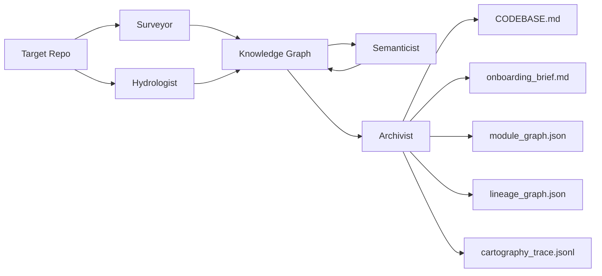

# Interim Report — The Brownfield Cartographer
Date: 2026-03-11

## Target Codebase (Manual Reconnaissance)
Repo: `.cartography_repos/ol-data-platform`

Qualification check:
- File count: 1215 files.
- Languages present: Python + SQL + YAML + JSON + Markdown.
- This repo meets the multi‑language requirement and is production‑grade (Dagster + dbt + Airbyte + Trino + Superset).

## Reconnaissance: Manual Day‑One Analysis (5 Questions)

1. **Primary data ingestion path**  
   Airbyte loads raw tables into the lakehouse as assets (Dagster Airbyte assets in `dg_projects/lakehouse/lakehouse/definitions.py`). Those raw tables are mapped into dbt sources under `ol_warehouse_raw_data` (e.g., `src/ol_dbt/models/staging/mitxonline/_mitxonline__sources.yml`). Staging models consume those sources (e.g., `src/ol_dbt/models/staging/mitxonline/stg__mitxonline__app__postgres__ecommerce_order.sql`) and feed intermediate + marts models (e.g., `src/ol_dbt/models/intermediate/mitxonline/int__mitxonline__ecommerce_order.sql` → `src/ol_dbt/models/marts/combined/marts__combined__orders.sql`).  
   Evidence: `dg_projects/lakehouse/lakehouse/definitions.py`, `src/ol_dbt/models/staging/mitxonline/_mitxonline__sources.yml`, `src/ol_dbt/models/staging/mitxonline/stg__mitxonline__app__postgres__ecommerce_order.sql`, `src/ol_dbt/models/intermediate/mitxonline/int__mitxonline__ecommerce_order.sql`, `src/ol_dbt/models/marts/combined/marts__combined__orders.sql`.

2. **3–5 most critical output datasets/endpoints**  
   - `src/ol_dbt/models/marts/combined/marts__combined__orders.sql` (cross‑platform orders mart)  
   - `src/ol_dbt/models/reporting/chatbot_usage_report.sql` (chatbot reporting output)  
   - `src/ol_dbt/models/dimensional/tfact_course_navigation_events.sql` (navigation events fact table)  
   - `src/ol_dbt/models/dimensional/dim_problem.sql` (problem dimension used by analytics)  
   - `src/ol_dbt/models/marts/combined/marts__combined_course_enrollment_detail.sql` (enrollment detail mart)  

3. **Blast radius if the most critical module fails**  
   If `dg_projects/lakehouse/lakehouse/definitions.py` fails to load, Airbyte assets + dbt assets don’t materialize in Dagster, which blocks the entire ingestion→staging→marts pipeline. At the dbt layer, a failure in `int__mitxonline__ecommerce_order.sql` propagates to combined marts like `marts__combined__orders.sql` and downstream reporting that relies on order data.  
   Evidence: `dg_projects/lakehouse/lakehouse/definitions.py`, `src/ol_dbt/models/intermediate/mitxonline/int__mitxonline__ecommerce_order.sql`, `src/ol_dbt/models/marts/combined/marts__combined__orders.sql`.

4. **Business logic concentrated vs. distributed**  
   - Concentrated in intermediate + marts: `src/ol_dbt/models/intermediate/mitxonline/int__mitxonline__ecommerce_order.sql` (multi‑table joins + business logic), and `src/ol_dbt/models/marts/combined/marts__combined__orders.sql` (cross‑platform consolidation).  
   - Distributed across staging + dimensional: staging models like `src/ol_dbt/models/staging/mitxonline/stg__mitxonline__app__postgres__ecommerce_order.sql` normalize raw fields; dimensional models like `src/ol_dbt/models/dimensional/dim_problem.sql` and fact models like `src/ol_dbt/models/dimensional/tfact_course_navigation_events.sql` embed domain‑specific rules.  

5. **What changed most frequently in the last 90 days**  
   Highest‑velocity files are dependency locks and reporting model metadata:  
   - `uv.lock`  
   - `dg_projects/lakehouse/uv.lock`  
   - `dg_projects/legacy_openedx/uv.lock`  
   - `dg_projects/learning_resources/uv.lock`  
   - `src/ol_dbt/models/reporting/_reporting__models.yml`  
   Evidence: `git log --since="90 days ago"` (repo‑level history).

### Difficulty Analysis (Manual Recon)
The hardest part was tracing lineage across multiple systems (Dagster Airbyte assets → dbt sources → staging → intermediate → marts). The entrypoint lives in Dagster definitions, while the actual transformations live in dbt SQL, so it’s easy to miss how a raw table turns into a reporting model. That pain point drives the Cartographer priority: show cross‑system lineage with explicit handoffs (Airbyte asset → dbt source → model chain).

## Architecture Diagram (Four‑Agent Pipeline)

## Progress Summary (Component Status)

| Component | Status | Notes |
|---|---|---|
| CLI (`src/cli.py`) | Working | `analyze` supports local path and `--repo` clone. |
| Orchestrator (`src/orchestrator.py`) | Working | Runs Surveyor → Hydrologist → Semanticist → Archivist. |
| Schemas (`src/models/schema.py`) | Working | Node/Edge/Graph schemas in place. |
| Tree‑sitter analyzer | Working | Python import + public symbol extraction. |
| SQL lineage analyzer | Working | `sqlglot` parsing, emits warnings on failures. |
| Surveyor agent | Working | Import graph + PageRank + git velocity + dead‑code heuristic. |
| Hydrologist agent | Partial | SQL lineage works; dataset naming still weak for dynamic SQL. |
| Graph serialization | Working | `module_graph.json` and `lineage_graph.json` generated for this repo. |
| Archivist outputs | Partial | For this repo, only module + lineage artifacts are present; semantic artifacts require LLM pass. |

## Early Accuracy Observations

Artifacts are generated for `ol-data-platform` at `.cartography_repos/ol-data-platform/.cartography/` (module_graph.json + lineage_graph.json).

Correct detections (lineage):
1) `ol_warehouse_raw_data.raw__mitxonline__app__postgres__ecommerce_order` → `stg__mitxonline__app__postgres__ecommerce_order` (staging consumes raw and produces stg).  
2) `stg__mitxonline__app__postgres__ecommerce_order` → `int__mitxonline__ecommerce_order` (intermediate consumes stg).  
3) `int__mitxonline__ecommerce_order` → `marts__combined__orders` (combined mart consumes intermediate).

Correct detections (module graph):
1) `dg_projects/data_loading/data_loading/defs/edxorg_s3_ingest/defs.py` imports `dagster_assets.py`.  
2) `dg_projects/data_loading/data_loading/defs/edxorg_s3_ingest/dagster_assets.py` imports `loads.py`.

Inaccuracies / gaps:
- Module graph is under‑connected (only 2 import edges across 1000+ modules). Import resolution is missing for most packages, so the module graph is incomplete and needs improved module mapping.

## Completion Plan for Final Submission (Sequenced)

1. **Module graph resolution**  
   - Improve import resolution for package roots and namespace packages.  
   - Increase edge coverage with correct module path mapping.
2. **Lineage hardening**  
   - Normalize dataset identifiers and resolve `source()`/`ref()` consistently.  
   - Reduce dynamic SQL ambiguity with structured warnings.
3. **Navigator query mode**  
   - Implement the four query tools (`find_implementation`, `trace_lineage`, `blast_radius`, `explain_module`).  
   - Add CLI entrypoint and tool‑level smoke tests.
4. **Incremental analysis**  
   - Add diff‑based re‑analysis and node‑hash caching.  
   - Merge deltas into the existing knowledge graph.
5. **Semanticist refinement**  
   - Strengthen code‑grounded prompts.  
   - Surface doc‑drift flags in outputs.

Risks:
- LLM‑based semantic steps depend on external APIs and may require tuning for stability.
- Dynamic SQL and Jinja introduce ambiguity that can still weaken lineage accuracy.

Fallback if time tight:
- Prioritize lineage correctness + Navigator; defer semantic clustering upgrades.

## PDF Outline (Interim Submission)

1. Title page
2. RECONNAISSANCE (manual Day-One analysis)
   Use `RECONNAISSANCE.md` content verbatim or summarized.
3. Architecture diagram
   Use the four‑agent pipeline diagram from this report.
4. Progress summary
   Reuse the component status table and short notes.
5. Early accuracy observations
   Include current correctness examples and known gaps.
6. Known gaps and plan for final submission
   Reuse the completion plan, risks, and fallback plan.
